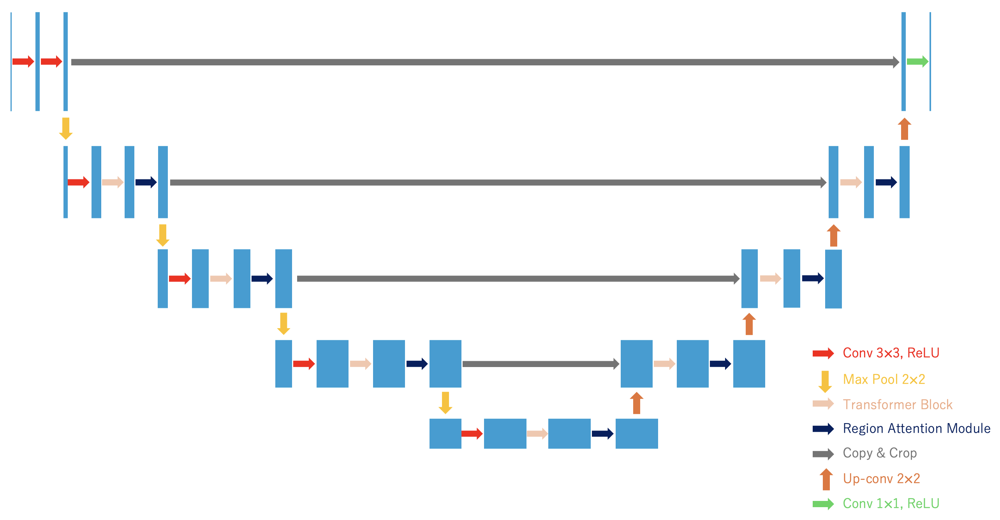
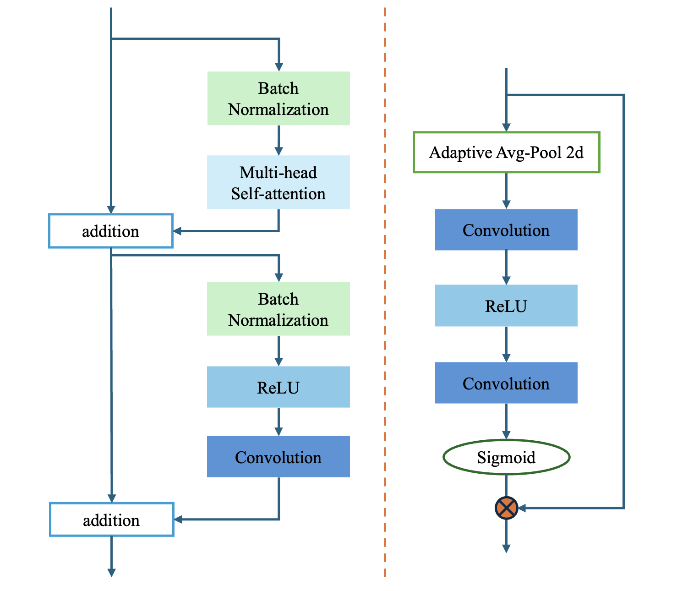

# TRAM-UNet: Transformer and Region Attention Module based U-Net for Breast Ultrasound Image Segmentation
Official PyTorch implementation of TRAM-UNet, as presented at the [IEEE EMBC 2025](https://ieeexplore.ieee.org/document/11253082).


## 📖 Introduction
Segmentation of breast ultrasound images is crucial for the early and accurate diagnosis of breast cancer. 
In this study, we propose TRAM-UNet (Transformer and Region Attention Module-Based U-Net), 
a novel deep learning model that integrates Transformer blocks and a Region Attention Module (RAM) to improve segmentation performance. 
TRAM-UNet achieves average Dice scores of 88.56±0.91%, 84.68±1.20%, and 83.96±1.34% on the BUS-BRA, BUSI, and BLUI datasets, respectively, significantly outperforming both U-Net and U-Net+Transformer across all datasets. 
These results demonstrate TRAM-UNet’s ability to refine boundaries, enhance segmentation accuracy, 
and adapt to different lesion characteristics, underscoring its potential to advance breast ultrasound segmentation and clinical diagnosis.

Clinical Relevance — This study is clinically relevant as it demonstrates the potential of deep learning in improving breast ultrasound image segmentation. With further research and optimization, this approach could contribute to more precise and automated breast cancer diagnosis in clinical practice.


## 🧱 Model Architecture
TRAM-UNet utilizes an encoder-decoder structure based on U-Net with skip connections.
<p align="center">
  
  <br>
  <em><b>Figure 1.</b> An overview of TRAM-UNet.</em>
</p>
<p align="center">
  
  <br>
  <em><b>Figure 2.</b> Overview of Transformer Block (left) and Region Attention Module (right).</em>
</p>


## 📂 Datasets
This study utilizes three public datasets:

1. [BUS-BRA](https://zenodo.org/records/8231412): 1,875 images from 1,064 patients (Brazil).
2. [BUSI](https://www.kaggle.com/datasets/sabahesaraki/breast-ultrasound-images-dataset): 780 images divided into normal, benign, and malignant (Cairo, Egypt).
3. [BLUI](https://qamebi.com/breast-ultrasound-images-database/): 232 images with original, GT mask, and fusion entries (Tehran University).


## 🛠️ Environment
The experiments were conducted using the following hardware and software configuration:<br>
**Framework:** The model is implemented using PyTorch11.<br>
**Hardware:** Training was performed on an NVIDIA A100-SXM4 GPU with 40GB of memory22.<br>
**Input Specifications:** All input ultrasound images are resized to 256 × 256 pixels.<br>


## 🎓 Citation
If you find this work helpful for your research, please cite our IEEE EMBC 2025 paper:

```
@INPROCEEDINGS{11253082,
  author={Zhou, Jiang and Sumi, Chikayoshi},
  booktitle={2025 47th Annual International Conference of the IEEE Engineering in Medicine and Biology Society (EMBC)}, 
  title={TRAM-UNet: Transformer and Region Attention Module based U-Net for Breast Ultrasound Image Segmentation}, 
  year={2025},
  volume={},
  number={},
  pages={1-4},
  doi={10.1109/EMBC58623.2025.11253082}}
```


## 📜 License
This project is licensed under the Apache License 2.0 - see the [LICENSE](./LICENSE) and [NOTICE](./NOTICE) files for details.

